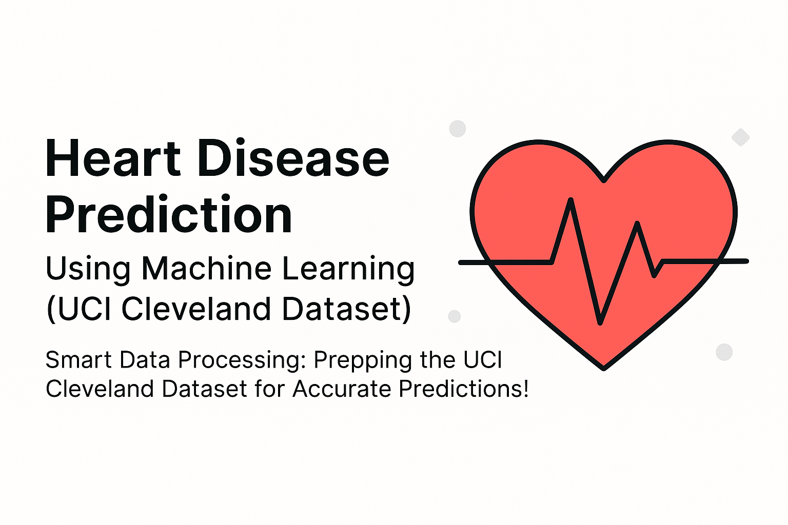

Predict heart disease risk in seconds using clinical data (85% accurate)
# ❤️ HeartGuard AI - Cardiovascular Risk Prediction System
Predict heart disease risk in seconds using clinical data (85% accurate)



**Developed by Musabbir KM**

## 🚀 Overview

An end-to-end machine learning system that predicts heart disease risk using clinical features, featuring:
- **XGBoost Classifier** with automated threshold optimization
- **Streamlit Web Application** for interactive predictions
- **Comprehensive Model Evaluation** (ROC AUC: 0.909)
- **Production-Ready Pipeline** with feature engineering

## 🌟 Key Features
| Feature | Description |
|---------|-------------|
| **Clinical Risk Assessment** | Classifies patients into High/Medium/Low risk categories |
| **Batch Processing** | Handles CSV uploads for multiple predictions |
| **Interactive Interface** | User-friendly Streamlit dashboard |
| **Model Explainability** | Detailed feature importance analysis |
| **Medical Recommendations** | Actionable insights based on risk level |

## 📊 Dataset Information
**Source:** [UCI Heart Disease Dataset](https://archive.ics.uci.edu/dataset/45/heart+disease)  
**Samples:** 303 patients (Cleaned: 297)  
**Features:** 13 clinical + 3 engineered features  
**Attributes**:
- Demographic: Age, Sex
- Medical: 
  - cp (Chest Pain Type)
  - trestbps (Resting Blood Pressure)
  - chol (Serum Cholesterol)
  - fbs (Fasting Blood Sugar)
  - restecg (Resting ECG)
  - thalach (Maximum Heart Rate)
  - exang (Exercise Induced Angina)
  - oldpeak (ST Depression)
  - slope (ST Segment Slope)
  - ca (Major Vessels)
  - thal (Thalassemia)


## 📊 Feature Description

    -age	Age in years
    sex	Gender (1 = male, 0 = female)
    cp	Chest pain type (1 = typical angina, 2 = atypical angina, 3 = non-anginal pain, 4 = asymptomatic)
    trestbps	Resting blood pressure (in mm Hg)
    chol	Serum cholesterol level (in mg/dl)
    fbs	Fasting blood sugar > 120 mg/dl (1 = true, 0 = false)
    restecg	Resting electrocardiographic results (0, 1, or 2)
    thalach	Maximum heart rate achieved
    exang	Exercise-induced angina (1 = yes, 0 = no)
    oldpeak	ST depression induced by exercise relative to rest
    slope	Slope of the peak exercise ST segment (1, 2, 3)
    ca	Number of major vessels (0–3) colored by fluoroscopy
    thal	Thalassemia (3 = normal, 6 = fixed defect, 7 = reversible defect)

## 📊 Performance Metrics

| Metric        | Score  |
|---------------|--------|
| Accuracy      | 85.2%  |
| Precision     | 84.7%  |
| Recall        | 87.5%  |
| F1-Score      | 85.2%  |

(Validation set performance)


# 🏆 Model Performance

## === Optimized Performance Metrics ===

- **Optimal Threshold:** `0.327`
- **Evaluation on Test Set:** `n = 46`

### 📊 Classification Report

| Class           | Precision | Recall | F1-Score | Support |
|----------------|-----------|--------|----------|---------|
| Healthy         | 0.95      | 0.76   | 0.84     | 25      |
| Heart Disease   | 0.77      | 0.95   | 0.85     | 21      |

### ✅ Overall Metrics

- **Accuracy:** `0.85`
- **Macro Average:**
  - Precision: `0.86`
  - Recall: `0.86`
  - F1-Score: `0.85`
- **Weighted Average:**
  - Precision: `0.87`
  - Recall: `0.85`
  - F1-Score: `0.85`

---

📌 This optimized threshold enhances **Heart Disease detection** (high recall) while maintaining high precision for **Healthy** predictions.


## ⚠️ Important Disclaimer

**This is NOT a medical diagnostic device.** By using this model, you agree that:

- It should not replace professional medical advice
- It is not for use in emergency situations
- Treatment decisions should not be based solely on its outputs
- Always consult qualified healthcare professionals

**Dataset Source**: [UCI Machine Learning Repository](https://archive.ics.uci.edu/dataset/45/heart+disease)

## 🛠️ Installation

1. Clone repository:
```bash
git clone https://github.com/musabbirkm/heart-disease-predictor.git
cd heart-disease-predictor
pip install -r requirements.txt
streamlit run app.py


